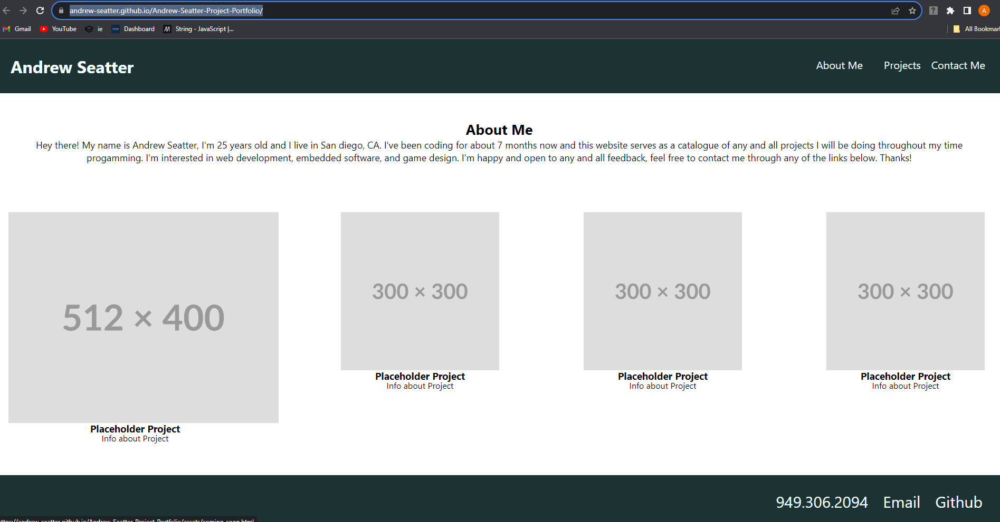

# Andrew-Seatter-Project-Portfolio

## Description
The goal of this project was to utilize our newfound flexbox and media query knowledge to build a project portfolio. I definetly was a little humbled and plan to revisit this as I work through some more course material and get a better feel for css. All of the images in the project section were placeholders until I can eventually have some more projects to fill that space.
## Usage
Portfolio acts as a a catalogue for future projects. All images act as links and they respond to different sizes of screens. Links in the nav bar will take you down to various parts of the page and all of the contact links on the bottom are functional as well.

Link to deployed website: https://andrew-seatter.github.io/Andrew-Seatter-Project-Portfolio/
## License

The MIT License (MIT)

Copyright (c) 2015 Chris Kibble

Permission is hereby granted, free of charge, to any person obtaining a copy of this software and associated documentation files (the "Software"), to deal in the Software without restriction, including without limitation the rights to use, copy, modify, merge, publish, distribute, sublicense, and/or sell copies of the Software, and to permit persons to whom the Software is furnished to do so, subject to the following conditions:

The above copyright notice and this permission notice shall be included in all copies or substantial portions of the Software.

THE SOFTWARE IS PROVIDED "AS IS", WITHOUT WARRANTY OF ANY KIND, EXPRESS OR IMPLIED, INCLUDING BUT NOT LIMITED TO THE WARRANTIES OF MERCHANTABILITY, FITNESS FOR A PARTICULAR PURPOSE AND NONINFRINGEMENT. IN NO EVENT SHALL THE AUTHORS OR COPYRIGHT HOLDERS BE LIABLE FOR ANY CLAIM, DAMAGES OR OTHER LIABILITY, WHETHER IN AN ACTION OF CONTRACT, TORT OR OTHERWISE, ARISING FROM, OUT OF OR IN CONNECTION WITH THE SOFTWARE OR THE USE OR OTHER DEALINGS IN THE SOFTWARE.